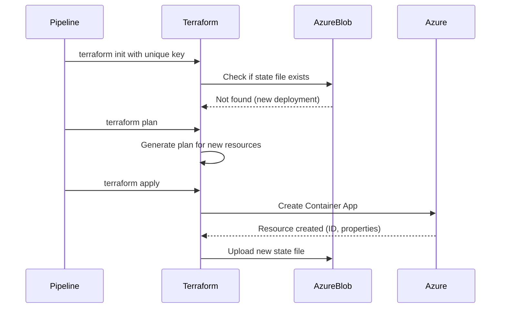

# HelloWorld Azure Container Apps - Terraform State Management

## TL;DR

This HelloWorld demo application uses a **non-standard per-build state file pattern** for Terraform. Most production applications should use a **single shared state file per environment**. This demo creates and destroys infrastructure with each pipeline run for testing purposes.

**Key Points:**
- **State Files**: Unique per build (`helloworld-12345.tfstate`) stored in environment-specific containers
- **Standard Pattern**: Production apps should use `myapp.tfstate` (same name across environments, different containers)
- **Storage Hierarchy**: Environment determined by container name (poc01, dev, staging, prod), not state file name
- **App Gateway**: InitializeCAE template configures App Gateway routing after Terraform deployment
- **Custom URLs**: Apps are accessible via browser-friendly URLs (e.g., `https://helloworld-dev-ca-12345-poc01.dev.ncontracts.com`)
- **Teardown**: Each build cleans up its own resources automatically

**Quick Links:**
- [HelloWorld README](https://github.com/NetworkContractSolutions/HelloWorld/blob/main/README.md)
- [HelloWorld Pipeline](https://dev.azure.com/NcontractsDevOps/NContracts/_build?definitionId=63&_a=summary)

---

## Table of Contents

1. [Overview](#overview)
2. [Terraform State Management Architecture](#terraform-state-management-architecture)
   - [What is Terraform State?](#what-is-terraform-state)
   - [Why Azure Storage Account Backend?](#why-azure-storage-account-backend)
3. [Storage Account Configuration](#storage-account-configuration)
   - [Backend Configuration Structure](#backend-configuration-structure)
   - [Storage Account Hierarchy](#storage-account-hierarchy)
4. [Pipeline Integration](#pipeline-integration)
   - [State File Strategy: Per-Build (Demo Application Pattern)](#state-file-strategy-per-build-demo-application-pattern)
   - [Standard Pattern (Recommended for Production)](#standard-pattern-recommended-for-production)
   - [HelloWorld Pattern (Demo/Testing Only)](#helloworld-pattern-demotesting-only)
   - [Pipeline Stages Using State](#pipeline-stages-using-state)
5. [Container App Environment (CAE) Integration](#container-app-environment-cae-integration)
   - [What is InitializeCAE?](#what-is-initializecae)
   - [Pipeline Configuration](#pipeline-configuration)
   - [InitializeCAE Parameters](#initializecae-parameters)
   - [What InitializeCAE Does](#what-initializecae-does)
   - [Custom URL Format](#custom-url-format)
   - [App Gateway Architecture](#app-gateway-architecture)
   - [Why Use App Gateway with Container Apps?](#why-use-app-gateway-with-container-apps)
   - [RemoveCAEIntegration (Teardown)](#removecaeintegration-teardown)
6. [URL Retrieval and Testing](#url-retrieval-and-testing)
7. [State File Lifecycle](#state-file-lifecycle)
8. [State Locking](#state-locking)
9. [Local Development with Terraform](#local-development-with-terraform)
10. [Troubleshooting](#troubleshooting)
11. [Best Practices](#best-practices)
    - [General Terraform State Management](#general-terraform-state-management-all-applications)
    - [Production Applications](#production-applications-standard-pattern)
    - [Demo/Test Applications](#demotest-applications-helloworld-pattern)
12. [Additional Resources](#additional-resources)

---

## Overview

This page documents how the HelloWorld application uses Terraform with Azure Storage Account backend for state management in the CI/CD pipeline.

For general project information, see the [HelloWorld README](https://github.com/NetworkContractSolutions/HelloWorld/blob/main/README.md).

To test run the pipeline, see the [HelloWorld Pipeline](https://dev.azure.com/NcontractsDevOps/NContracts/_build?definitionId=63&_a=summary).

---

## Terraform State Management Architecture

### What is Terraform State?

Terraform state is a critical file (`*.tfstate`) that tracks the current state of your infrastructure. It maps your Terraform configuration to real-world Azure resources, enabling Terraform to:

- Know what resources it has created
- Detect configuration drift
- Plan changes accurately
- Manage dependencies between resources

### Why Azure Storage Account Backend?

The HelloWorld project uses **Azure Blob Storage** as the Terraform backend instead of local state files because:

1. **Remote State**: Multiple pipeline runs can access the same state
2. **State Locking**: Prevents concurrent modifications that could corrupt state
3. **Versioning**: Azure Blob Storage can maintain state file history
4. **Security**: State files may contain sensitive data; blob storage provides encryption at rest
5. **Collaboration**: Team members and pipelines share the same source of truth

---

## Storage Account Configuration

### Backend Configuration Structure

The Terraform backend is configured in `providers.tf`:

```hcl
terraform {
  backend "azurerm" {
    resource_group_name  = "rg-dev-devops-usc"
    storage_account_name = "stdevtfstateusc"
    # container_name and key are provided dynamically via --backend-config flags
  }
}
```

### Storage Account Hierarchy

```
Storage Account: stdevtfstateusc
└── Container (per environment): poc01, dev, staging, prod
    └── State Files: helloworld.tfstate (or helloworld-{buildId}.tfstate for demo apps)
```

**Standard Production Example:**
- Storage Account: `stdevtfstateusc`
- Container: `poc01` (defines the environment)
- State File: `myapp.tfstate` (same filename in all environment containers)

**HelloWorld Demo Example:**
- Storage Account: `stdevtfstateusc`
- Container: `poc01` (defines the environment)
- State File: `helloworld-12345.tfstate` (unique per build)

**Key Concept:** The **container name determines the environment**, not the state file name. This allows the same state file name (e.g., `myapp.tfstate`) to exist in multiple environments (dev, staging, prod containers).

---

## Pipeline Integration

### State File Strategy: Per-Build (Demo Application Pattern)

> **IMPORTANT**: This demo application uses a **non-standard pattern** of creating unique state files per build. **Most production applications should use a single shared state file** (e.g., `myapp.tfstate`) stored in environment-specific containers.

#### Standard Pattern (Recommended for Production)

For typical applications with persistent infrastructure:

```yaml
# Standard approach - single state file name across all environments
# Environment is determined by the container name, not the state file name
$STATE_FILE_KEY = "myapp.tfstate"
```

**Benefits:**
- Infrastructure persists across deployments
- State file tracks the current environment's resources
- Updates modify existing resources rather than recreating them
- Single source of truth for what's deployed in each environment
- Same state file name across all environments (simpler pipeline configuration)

#### HelloWorld Pattern (Demo/Testing Only)

Because HelloWorld is a **temporary demo application** that gets torn down after each test, it uses unique state files per build:

```yaml
# Demo approach - unique state file per build
# Container name still determines the environment
$STATE_FILE_KEY = "helloworld-$(Build.BuildId).tfstate"
```

**Format:** `helloworld-{buildId}.tfstate`

**Examples (all in container `poc01`):**
- `helloworld-12345.tfstate` (Build 12345 in poc01 environment)
- `helloworld-12346.tfstate` (Build 12346 in poc01 environment)
- `helloworld-54321.tfstate` (Build 54321 in poc01 environment)

**Note:** The environment is determined by which container the state file is stored in, not by the filename itself.

**Why use this pattern?**

This approach is appropriate for HelloWorld because:

1. **Parallel Testing**: Multiple builds can run simultaneously without state conflicts
2. **Build Isolation**: Each build's infrastructure is tracked independently
3. **Easy Cleanup**: Teardown operations only affect the specific build's resources
4. **No Persistent Infrastructure**: Resources are created and destroyed with each build
5. **Testing/Demo Purpose**: This is not a production application

**When to use per-build state files:**
- Demo or proof-of-concept applications
- Temporary test environments
- CI/CD test stages that create and destroy infrastructure
- Parallel development environments

**When NOT to use per-build state files:**
- Production applications
- Staging/UAT environments
- Any infrastructure that should persist between deployments
- Applications with data persistence requirements

### Pipeline Stages Using State

#### 1. TerraformPlan Stage

```yaml
terraform init \
  --backend-config="container_name=$(EnvironmentName)" \
  --backend-config="key=$STATE_FILE_KEY" \
  --reconfigure

terraform plan \
  --var="container_image=$(ContainerRegistryLoginServer)/$(ContainerRegistryRepository):$(Build.BuildId)" \
  --out=tfplan
```

**What happens:**
1. Initializes Terraform with the unique state file key
2. Creates the state file in Azure Blob Storage if it doesn't exist
3. Generates an execution plan
4. Publishes the plan as a pipeline artifact

#### 2. Deploy Stage

```yaml
terraform init \
  --backend-config="container_name=$(EnvironmentName)" \
  --backend-config="key=$STATE_FILE_KEY" \
  --reconfigure

terraform apply --auto-approve tfplan
```

**What happens:**
1. Re-initializes with the same state file key
2. Downloads the state file from Azure Blob Storage
3. Applies the pre-approved plan
4. Updates the state file with the deployed resources
5. Uploads the updated state file back to blob storage
6. **Runs InitializeCAE1 template** to configure App Gateway routing (see below)
7. Retrieves the Container App URL for testing

---

## Container App Environment (CAE) Integration

### What is InitializeCAE?

After Terraform creates the Container App, the pipeline runs the `InitializeCAE1` template to configure **Azure Application Gateway** routing. This step is necessary because:

1. **Terraform creates the Container App** with Azure-provided FQDN (e.g., `helloworld-dev-ca-12345.nicesky-abc123.centralus.azurecontainerapps.io`)
2. **InitializeCAE configures App Gateway** to route custom domain traffic to the Container App
3. **Custom routing rules** are created based on the Container App name and environment

### Pipeline Configuration

```yaml
- template: Templates/Tasks/InitializeCAE1.yml@infrastructure
  parameters:
    ServiceConnectionName: '$(AzureResourceManagerSC)'
    EnvironmentName: '$(EnvironmentName)'
    BrowserFriendlyRouting: true
    ContainerAppFilter: '^$(ContainerAppName)$'
    InternalOnly: true
```

### InitializeCAE Parameters

| Parameter | Value | Description |
|-----------|-------|-------------|
| `ServiceConnectionName` | `$(AzureResourceManagerSC)` | Azure service connection for deploying App Gateway rules |
| `EnvironmentName` | `$(EnvironmentName)` | Environment name (e.g., `poc01`) used for App Gateway configuration |
| `BrowserFriendlyRouting` | `true` | Enables human-readable URLs instead of Azure-generated FQDNs |
| `ContainerAppFilter` | `^$(ContainerAppName)$` | Regex filter to match specific Container App (e.g., `^helloworld-dev-ca-12345$`) |
| `InternalOnly` | `true` | Restricts access to internal network only (no public internet exposure) |

### What InitializeCAE Does

1. **Discovers Container Apps**: Uses the `ContainerAppFilter` regex to find matching Container Apps in the environment
2. **Configures App Gateway Backend Pool**: Adds the Container App's FQDN to the App Gateway backend pool
3. **Creates Routing Rules**: Sets up HTTP/HTTPS routing rules based on the environment and app name
4. **Configures Custom Domain**: Maps the Container App to a browser-friendly URL pattern
5. **Applies SSL/TLS Certificates**: Ensures HTTPS traffic is properly terminated at the App Gateway

### Custom URL Format

After InitializeCAE runs, the Container App is accessible via a custom URL:

**Format:** `https://{container-app-name}-{environment}.{domain}`

**Example:**
- Container App Name: `helloworld-dev-ca-12345`
- Environment: `poc01`
- Custom URL: `https://helloworld-dev-ca-12345-poc01.dev.ncontracts.com`

This URL is retrieved by the pipeline and used for integration testing:

```yaml
- task: AzureCLI@2
  displayName: 'Get CA URL'
  name: retrieveurl
  inputs:
    inlineScript: |
      $deployment = 'https://$(ContainerAppName)-$(EnvironmentName).dev.ncontracts.com'
      Write-Host "##vso[task.setvariable variable=ContainerAppUrl;isOutput=true]$deployment"
```

### App Gateway Architecture

```
Internet/Internal Network
         │
         ▼
┌─────────────────────┐
│  Application Gateway │
│  - SSL Termination   │
│  - Custom Domain     │
│  - Routing Rules     │
└──────────┬──────────┘
           │
           ▼
┌──────────────────────────┐
│ Container App Environment │
│  ┌────────────────────┐  │
│  │  Container App     │  │
│  │  (Your App)        │  │
│  │  Port 8080         │  │
│  └────────────────────┘  │
└──────────────────────────┘
```

### Why Use App Gateway with Container Apps?

| Feature | Container App Ingress Only | With App Gateway |
|---------|---------------------------|------------------|
| **Custom Domain** | Azure-provided FQDN only | Custom domain (e.g., `*.dev.ncontracts.com`) |
| **SSL Certificates** | Azure-managed cert per app | Centralized certificate management |
| **Network Security** | Public or internal | Additional WAF and DDoS protection |
| **Routing Flexibility** | Basic path-based routing | Advanced rules, redirects, rewrites |
| **Multiple Apps** | Individual ingress per app | Single entry point for multiple apps |
| **Monitoring** | Container App metrics | App Gateway + Container App metrics |

### RemoveCAEIntegration (Teardown)

Before running `terraform destroy`, the pipeline removes the App Gateway configuration:

```yaml
- template: Templates/Tasks/RemoveCAEIntegration1.yml@infrastructure
  parameters:
    ServiceConnectionName: '$(AzureResourceManagerSC)'
    EnvironmentName: '$(EnvironmentName)'
    ContainerAppName: '$(ContainerAppName)'
```

**What RemoveCAEIntegration does:**
1. Finds the Container App's backend pool entry in the App Gateway
2. Removes the routing rules associated with this Container App
3. Deletes the backend pool entry
4. Cleans up any custom domain mappings
5. Ensures App Gateway is in a clean state before Container App is destroyed

**Why this step is important:**
- Prevents orphaned backend pool entries pointing to deleted Container Apps
- Avoids App Gateway health probe failures after Container App is destroyed
- Keeps App Gateway configuration clean and manageable
- Ensures teardown is complete and doesn't leave configuration debris

**Note:** This step uses `continueOnError: true` to ensure teardown proceeds even if CAE integration cleanup fails.

---

## URL Retrieval and Testing

After deployment and CAE integration, the pipeline retrieves two URLs:

### 1. Azure Container Apps Ingress URL (Native)

```yaml
$aca = az containerapp list -g $(ResourceGroup) | ConvertFrom-Json | Where-Object {$_.name -eq "$(ContainerAppName)"}
$url = "https://" + $aca.properties.configuration.ingress.fqdn
```

**Example:** `https://helloworld-dev-ca-12345.nicesky-abc123.centralus.azurecontainerapps.io`

**Characteristics:**
- Azure-provided FQDN
- Always available (doesn't depend on App Gateway)
- Used for direct Container App access
- Not browser-friendly for end users

### 2. App Gateway Custom URL (After InitializeCAE)

```yaml
$deployment = 'https://$(ContainerAppName)-$(EnvironmentName).dev.ncontracts.com'
```

**Example:** `https://helloworld-dev-ca-12345-poc01.dev.ncontracts.com`

**Characteristics:**
- Custom domain routed through App Gateway
- Browser-friendly URL
- Used by integration tests
- Requires App Gateway and DNS configuration

The pipeline uses the **App Gateway URL** for integration tests because it validates the complete routing stack.

#### 3. Teardown Stage

```yaml
terraform destroy --auto-approve \
  --var="container_image=$(ContainerRegistryLoginServer)/$(ContainerRegistryRepository):$(Build.BuildId)" \
  # ... other variables
```

**What happens:**
1. Reads the state file for this specific build
2. Destroys only the resources tracked in that state file
3. Marks resources as destroyed in the state file
4. State file remains in storage for audit purposes

---

## State File Lifecycle

### State File Creation



### State File Updates

When you modify infrastructure (e.g., change container image):

1. Pipeline passes new `container_image` variable with new Build ID
2. Terraform downloads existing state file
3. Compares desired state (new image) vs current state (old image)
4. Plans update operation
5. Updates Container App with new image
6. Writes updated state back to blob storage

### State File Cleanup

State files are **not automatically deleted** after teardown. This provides:

- Audit trail of what was deployed
- Ability to investigate issues post-teardown
- Historical record of infrastructure changes

**Manual cleanup** can be performed via Azure Portal or CLI:

```bash
# List state files in a container
az storage blob list \
  --account-name stdevtfstateusc \
  --container-name poc01 \
  --output table

# Delete old state files (optional)
az storage blob delete \
  --account-name stdevtfstateusc \
  --container-name poc01 \
  --name helloworld-poc01-12345.tfstate
```

---

## State Locking

Azure Blob Storage provides **automatic state locking** via blob leases:

1. When `terraform plan` or `terraform apply` runs, Terraform acquires a lease on the state blob
2. Other operations attempting to use the same state file will wait
3. The lease is released when the operation completes
4. If the process crashes, the lease automatically expires after 15 seconds

**Lock Timeout Error:**

```
Error: Error acquiring the state lock

Lock Info:
  ID:        xxxxx-xxxxx-xxxxx-xxxxx
  Path:      helloworld-poc01-12345.tfstate
  Operation: OperationTypePlan
```

**Resolution:**
- Usually resolves automatically within 15 seconds
- Indicates another process is using the same state file
- With unique build IDs, this should be rare

---

## Local Development with Terraform

If you need to run Terraform locally (not recommended for production):

### Option 1: Use Existing State File

```bash
cd Infrastructure/Terraform

# Authenticate to Azure
az login

# Initialize with specific build's state file
terraform init \
  --backend-config="container_name=poc01" \
  --backend-config="key=helloworld-12345.tfstate" \
  --reconfigure

# View current state
terraform show

# Make changes (be careful!)
terraform plan -var="container_image=ncontracts.azurecr.io/helloworld:12345"
terraform apply -var="container_image=ncontracts.azurecr.io/helloworld:12345"
```

### Option 2: Use Local State File (Testing Only)

```bash
cd Infrastructure/Terraform

# Create a local backend config (not committed to git)
cat > backend-local.tf << EOF
terraform {
  backend "local" {
    path = "terraform.tfstate"
  }
}
EOF

# Initialize with local backend
terraform init -migrate-state

# Work with local state
terraform plan -var="container_image=ncontracts.azurecr.io/helloworld:test"
```

**Important:** Never commit local state files to git!

---

## Troubleshooting

### State File Not Found

**Error:**
```
Error: Failed to get existing workspaces: storage: service returned error:
StatusCode=404, ErrorCode=ContainerNotFound
```

**Solution:**
- Verify the container name matches the environment: `poc01`, etc.
- Check that the container exists in storage account `stdevtfstateusc`
- Verify service connection has access to the storage account

### State File Locked

**Error:**
```
Error: Error acquiring the state lock
```

**Solution:**
- Wait 15 seconds for the lease to automatically expire
- Check if another pipeline run is in progress
- Verify the Build ID is unique (shouldn't conflict with unique state files)

### Container App Already Exists

**Error:**
```
Error: A resource with the ID "/subscriptions/.../containerApps/helloworld-dev-ca-12345" already exists
```

**Solution:**
- This means the Container App exists but isn't tracked in the current state file
- Either import the existing resource or delete it manually:

```bash
# Delete existing Container App
az containerapp delete \
  --name helloworld-dev-ca-12345 \
  --resource-group rg-poc01-usc \
  --yes

# Then re-run the pipeline
```

### State Drift Detected

**Error:**
```
Note: Objects have changed outside of Terraform
```

**Solution:**
- Someone modified resources via Azure Portal or CLI
- Run `terraform apply` to bring state back in sync
- In this pipeline, teardown will clean up anyway

---

## Best Practices

### General Terraform State Management (All Applications)

#### Do's ✅

- **Let the pipeline manage state files** - Don't manually edit state files
- **Review terraform plans** - Check the TerraformPlan stage logs before deploy
- **Keep backend config secure** - Don't commit backend credentials to git
- **Use specific image tags** - Never use 'latest' tags (enforced in variables.tf)
- **Enable state locking** - Azure Blob Storage provides this automatically
- **Monitor state file growth** - Clean up old/unused state files periodically

#### Don'ts ❌

- **Don't manually modify state files** - Use `terraform state` commands if needed
- **Don't delete state files for active resources** - Leads to orphaned resources
- **Don't bypass state locking** - Can corrupt state files
- **Don't commit state files to git** - Always use remote backend

### Production Applications (Standard Pattern)

#### Do's ✅

- **Reuse state files across deployments** - Use one state file per environment (e.g., `myapp-prod.tfstate`)
- **Protect production state files** - Implement access controls and soft delete on storage account
- **Enable state versioning** - Azure Blob Storage versioning helps recover from mistakes
- **Plan before applying** - Always review changes before deploying to production
- **Use workspace separation** - Separate dev/staging/prod into different containers or storage accounts

#### Don'ts ❌

- **Don't create new state files per deployment** - This loses track of existing infrastructure
- **Don't delete state files between deployments** - Your infrastructure will become unmanaged
- **Don't allow parallel deployments to same environment** - State locking prevents this, but be aware

### Demo/Test Applications (HelloWorld Pattern)

#### Do's ✅

- **Use unique build IDs for state files** - Enables parallel testing (e.g., `helloworld-12345.tfstate`)
- **Clean up old test state files** - Automate deletion of state files older than X days
- **Document the non-standard pattern** - Make it clear this is for testing only

#### Don'ts ❌

- **Don't use this pattern for production apps** - Production needs persistent infrastructure
- **Don't let test state files accumulate indefinitely** - Implement cleanup policies

---

## Additional Resources

- [Terraform Azure Backend Documentation](https://www.terraform.io/docs/language/settings/backends/azurerm.html)
- [Azure Blob Storage State Locking](https://www.terraform.io/docs/language/settings/backends/azurerm.html#state-locking)
- [HelloWorld Project README](https://github.com/NetworkContractSolutions/HelloWorld/blob/main/README.md)
- [HelloWorld Pipeline](https://dev.azure.com/NcontractsDevOps/NContracts/_build?definitionId=63&_a=summary)
- [Terraform State Management Best Practices](https://www.terraform.io/docs/language/state/index.html)

